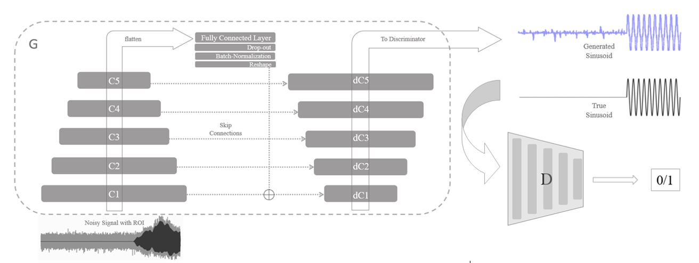
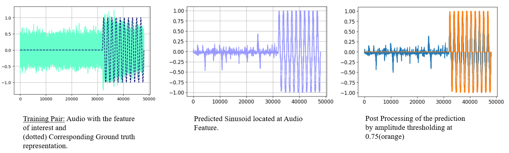
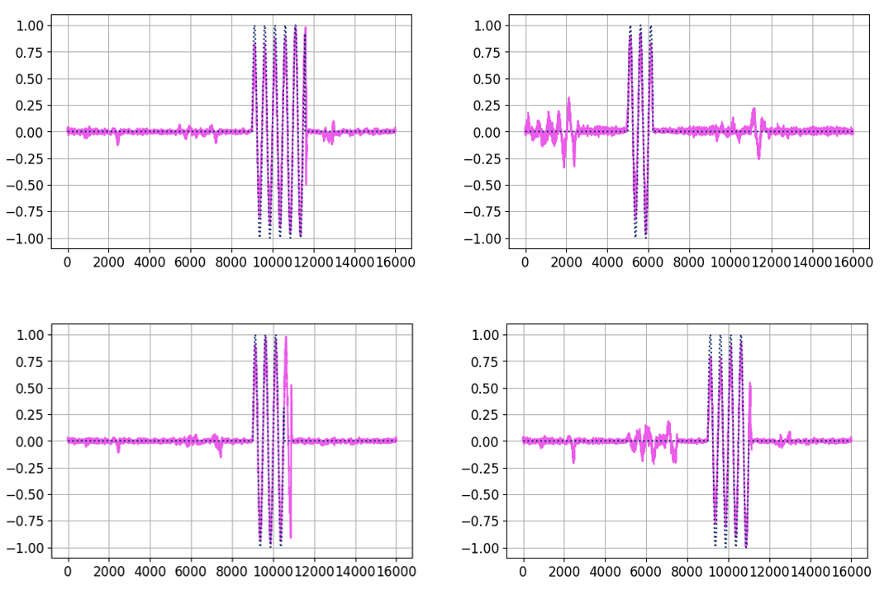
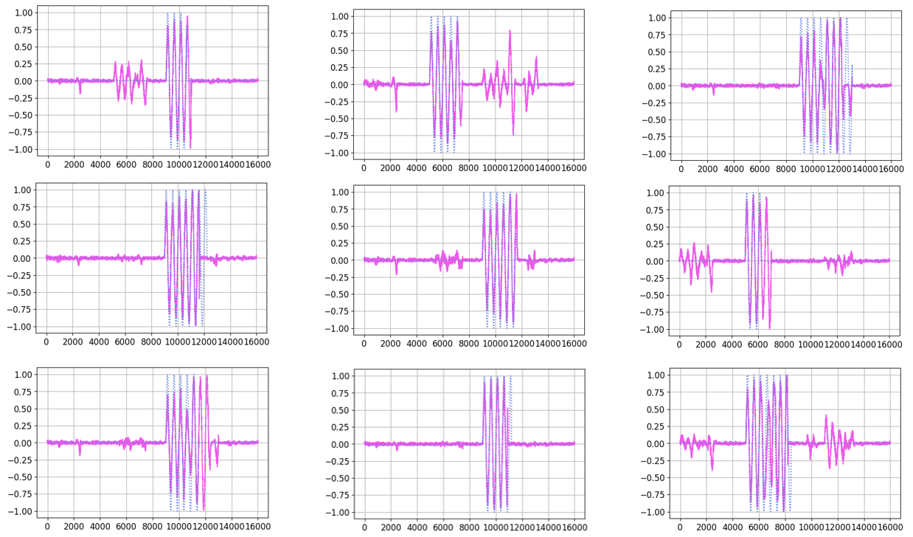
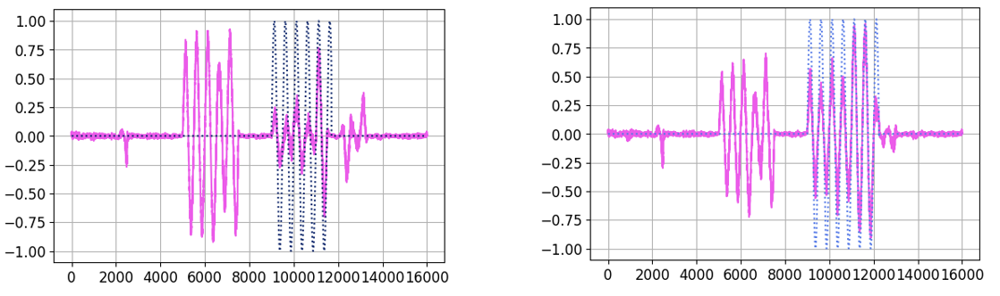
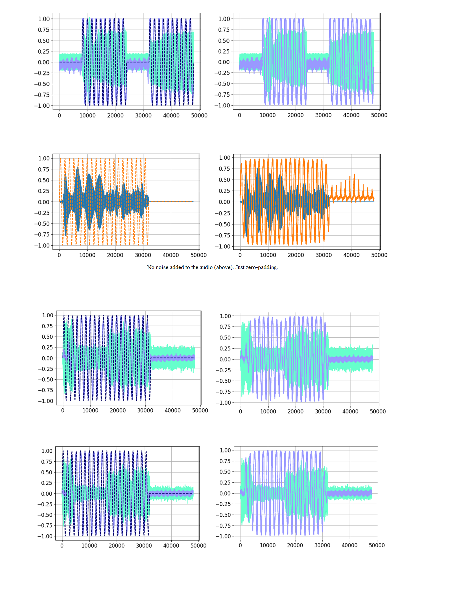
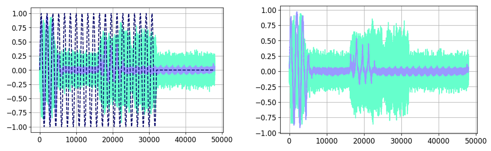

# ADVERSARIAL AUDIO EVENT LOCALIZATION AND DETECTION 

Implementation of the Generative Adversarial Localization of Audio Regions of Interest (ROI) using a learned sinusoid representation.

Paper: ICASSP 2020 submision (coming soon)

## Architecture

## Training Pairs, Prediction and Post-Processing

## Samples

**UPDATE (11/1/2019):** We have now added validation samples from our experiments on [CLO-43SD](https://wp.nyu.edu/birdvox/codedata/) dataset from Birdvox. The dataset consists of 43 different species of North American woodwarblers in from of ROIs. Total number of ROIs were 5,428 which were processed later to 1 sec by adding padding and noise, as input to the Generative localizer.

The results reflect the Generative localizer's capacity to localize variable length events which are also very short (0.1 sec to 0.3 sec). In our intital experiments with very noisy samples, we got over 90% accuracy in localizing the ROI with under 1% of False positives.

Validation set results at 36th Epoch. Dotted - Ground Truth. Solid Pink - Predicted Sinusoid.

Examples of false positives:

### **The following samples were included and relevant to the ICASSP submission:**

The input can be a 3-second audio sampled at 16000 Hz. For demonstration purposes, the ROI here is a 1 or two 1-second audio features next to each other, which can be an instrument or an uttered digit.

**These samples reflect the validation audio set performance.** The generated training samples are much crisper; Not included here.

Overlaying the signals to aid visual comparison.

Example of a sub-optimal and conservative prediction:

## Dataset and Performance

This approximation can successfully map the ROI on the validation, from the start and stop points for over 98% of the ROIs (989/1000) for the [Nsynth](https://magenta.tensorflow.org/datasets/nsynth) instrument dataset and (840/1000) for the [SC-09](https://github.com/chrisdonahue/wavegan#datasets) dataset.

#### Implementation

We are releasing a Jupyter-Notebook which includes the TensorFlow implementation. Might soon include the .html of notebook for listening to the audio, to judge the noisiness of the input audio.
