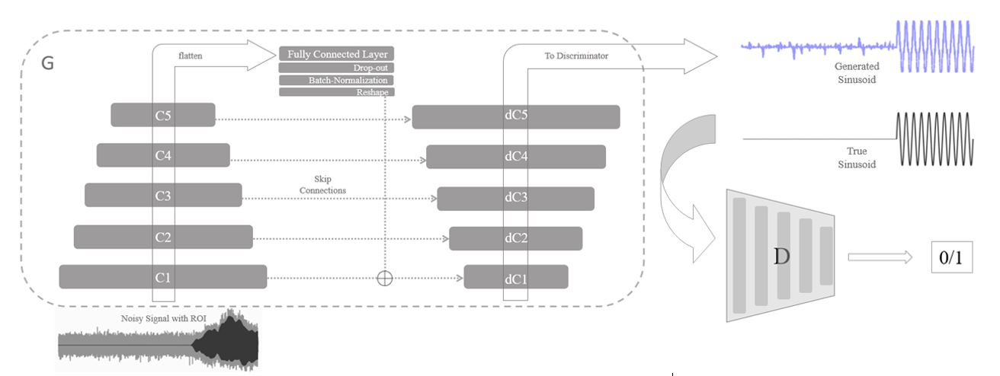
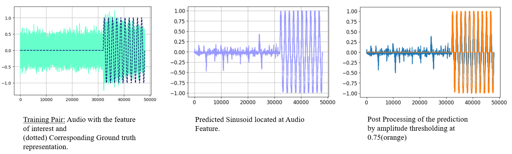
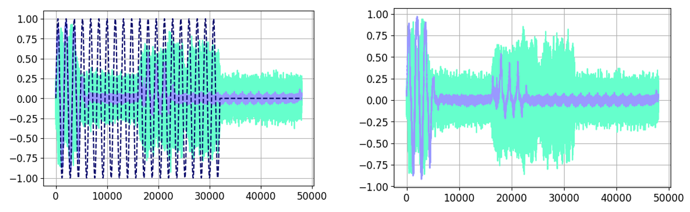

# ADVERSARIAL AUDIO EVENT LOCALIZATION AND DETECTION 

Implementation of the Generative Adversarial Localization of Audio Regions of Interest (ROI) using a learned sinusoid representation.

Paper: ICASSP 2020 submision (coming soon)

## Architecture

## Training Pairs, Prediction and Post-Processing

## Samples
The input can be a 3-second audio sampled at 16000 Hz. For demonstration purposes, the ROI here is a 1 or two 1-second audio features next to each other, which can be an instrument or an uttered digit.

**These samples reflect the validation audio set performance.** The generated training samples are much crisper; Not included here.

Overlaying the signals to aid visual comparison.

Example of a bad prediction:

## Dataset and Performance

This approximation can successfully map the ROI on the validation, from the start and stop points for over 98% of the ROIs (989/1000) for the [Nsynth](https://magenta.tensorflow.org/datasets/nsynth) instrument dataset and (840/1000) for the [SC-09](https://github.com/chrisdonahue/wavegan#datasets) dataset.

#### Implementation

We are releasing a Jupyter-Notebook which includes the TensorFlow implementation. Might soon include the .html of notebook for listening to the audio, to judge the noisiness of the input audio.
